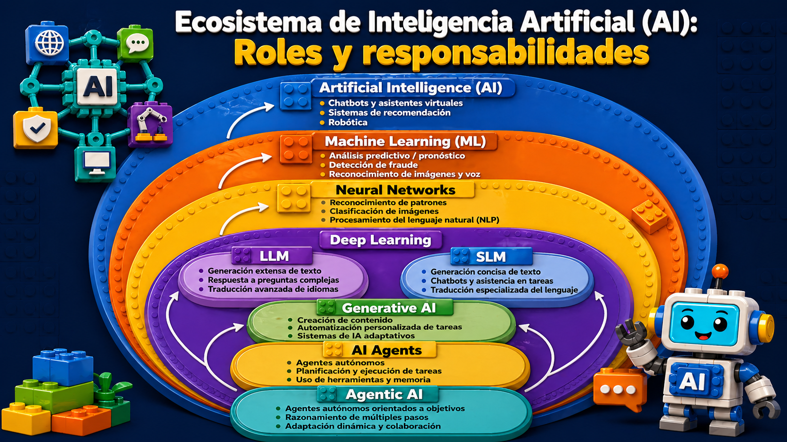
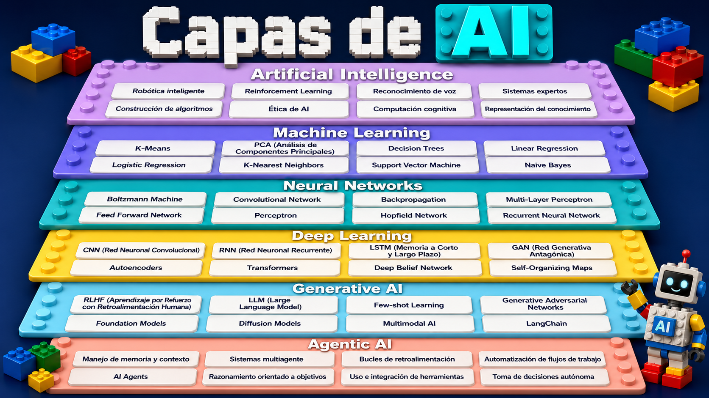

# IA EN EL MUNDO DEL DESARROLLO DE SOFTWARE 

La inteligencia artificial cumple un papel clave en el desarrollo de software porque ayuda a automatizar tareas, detectar errores, optimizar código y acelerar la creación de soluciones digitales. Su importancia radica en que permite a los programadores trabajar con mayor eficiencia, mejorar la calidad de los sistemas y reducir tiempos de desarrollo. Además, la IA facilita la innovación, ya que puede analizar grandes cantidades de datos, apoyar la toma de decisiones y crear herramientas más inteligentes y adaptadas a las necesidades de los usuarios.

---

---

---
## TAREA

**Explicar (EN ESTE README) cada uno de los concepTos de las capas de la AI**.

## SOLUCION

# Capas de IA: Inteligencia Artificial y Machine Learning

Este documento proporciona una explicación detallada de los dos primeros niveles fundamentales en el ámbito de la Inteligencia Artificial, tal como se presentan en la imagen de referencia: **Inteligencia Artificial** y **Machine Learning**. Se abordan sus conceptos centrales y los subtérminos clave asociados a cada uno, con el objetivo de ofrecer una comprensión estructurada para un público técnico.

## 1. Inteligencia Artificial (IA)

La **Inteligencia Artificial** (IA) es un campo multidisciplinario de la informática que se dedica al desarrollo de sistemas capaces de realizar tareas que, tradicionalmente, requieren inteligencia humana. Esto incluye capacidades como el razonamiento, el aprendizaje, la percepción, la comprensión del lenguaje y la toma de decisiones. Su objetivo principal es crear agentes inteligentes que puedan operar de manera autónoma y adaptarse a entornos cambiantes.

| Subtérmino | Descripción |
|:---|:---|
| **Robótica inteligente** | Rama de la robótica que integra principios de IA para dotar a los robots de capacidades cognitivas, permitiéndoles percibir su entorno, planificar acciones, aprender de la experiencia y ejecutar tareas complejas con autonomía y adaptabilidad. Esto va más allá de la automatización programada, buscando una interacción más dinámica y flexible con el mundo real. |
| **Reinforcement Learning (Aprendizaje por Refuerzo)** | Paradigma de aprendizaje automático donde un agente aprende a tomar decisiones óptimas en un entorno dinámico mediante la interacción y la recepción de señales de recompensa o castigo. El objetivo es maximizar la recompensa acumulada a lo largo del tiempo, desarrollando una política de comportamiento a través de la exploración y la explotación. |
| **Reconocimiento de voz** | Tecnología que permite a los sistemas informáticos identificar, procesar y transcribir el lenguaje hablado humano a texto. Se basa en modelos acústicos y de lenguaje para interpretar fonemas y palabras, facilitando la interacción natural entre humanos y máquinas a través de interfaces de voz. |
| **Ética de AI** | Campo de estudio que examina las implicaciones morales, sociales y filosóficas del diseño, desarrollo, despliegue y uso de sistemas de inteligencia artificial. Aborda cuestiones críticas como la equidad algorítmica, la privacidad de los datos, la responsabilidad, la transparencia y el impacto en el empleo y la sociedad. |
| **Computación cognitiva** | Enfoque de la IA que busca simular los procesos de pensamiento humano, incluyendo el razonamiento, la comprensión del lenguaje natural, el aprendizaje y la interacción. Los sistemas cognitivos están diseñados para procesar grandes volúmenes de datos no estructurados, identificar patrones y ofrecer recomendaciones para apoyar la toma de decisiones humana. |
| **Sistemas expertos** | Programas de IA que emulan el conocimiento y la capacidad de razonamiento de un experto humano en un dominio específico. Utilizan una base de conocimientos (hechos y reglas) y un motor de inferencia para resolver problemas complejos, diagnosticar situaciones o proporcionar asesoramiento, a menudo con explicaciones sobre su proceso de decisión. |
| **Construcción de algoritmos** | Proceso fundamental en la informática y la IA que implica el diseño sistemático de secuencias finitas de instrucciones bien definidas para resolver un problema o realizar una tarea específica. En IA, esto a menudo se centra en algoritmos que permiten el aprendizaje, la optimización, la búsqueda o la representación del conocimiento. |
| **Representación del conocimiento** | Área de la IA que se ocupa de cómo estructurar y almacenar información sobre el mundo de manera que un sistema inteligente pueda acceder a ella, razonar sobre ella y utilizarla para resolver problemas. Implica el uso de lógicas formales, redes semánticas, ontologías y otros formalismos para modelar el conocimiento. |

## 2. Machine Learning (Aprendizaje Automático)

El **Machine Learning** (ML) es una rama de la Inteligencia Artificial que se centra en el desarrollo de algoritmos y modelos estadísticos que permiten a los sistemas aprender de los datos, identificar patrones y tomar decisiones o hacer predicciones con una intervención humana mínima. A diferencia de la programación explícita, el ML permite a las máquinas mejorar su rendimiento en una tarea específica a medida que se exponen a más datos.

| Subtérmino | Descripción |
|:---|:---|
| **K-Means** | Algoritmo de agrupamiento (clustering) no supervisado que particiona un conjunto de `n` observaciones en `k` grupos, donde cada observación pertenece al grupo cuyo centroide (media) es el más cercano. Su objetivo es minimizar la varianza intra-clúster, siendo ampliamente utilizado para la segmentación de datos. |
| **PCA (Análisis de Componentes Principales)** | Técnica de reducción de dimensionalidad utilizada para transformar un conjunto de variables posiblemente correlacionadas en un conjunto de variables linealmente no correlacionadas, llamadas componentes principales. Estas componentes capturan la mayor parte de la varianza en los datos, facilitando la visualización y el preprocesamiento para otros algoritmos de ML. |
| **Decision Trees (Árboles de Decisión)** | Modelos predictivos no paramétricos que utilizan una estructura similar a un diagrama de flujo para clasificar o predecir un valor objetivo. Cada nodo interno representa una prueba sobre un atributo, cada rama representa el resultado de la prueba y cada nodo hoja representa una etiqueta de clase o un valor de predicción. Son intuitivos y fáciles de interpretar. |
| **Linear Regression (Regresión Lineal)** | Modelo estadístico supervisado que establece una relación lineal entre una variable dependiente continua y una o más variables independientes. Se utiliza para predecir valores numéricos continuos, ajustando una línea recta (o hiperplano) a los datos para minimizar la suma de los cuadrados de los errores. |
| **Logistic Regression (Regresión Logística)** | A pesar de su nombre, es un algoritmo de clasificación supervisado que modela la probabilidad de que una instancia pertenezca a una clase particular. Utiliza una función logística (sigmoide) para mapear cualquier valor real a un rango entre 0 y 1, siendo fundamental para problemas de clasificación binaria y multiclase. |
| **K-Nearest Neighbors (K-Vecinos Más Cercanos)** | Algoritmo de clasificación y regresión no paramétrico y basado en instancias. Clasifica un nuevo punto de datos basándose en la mayoría de las clases (para clasificación) o el promedio de los valores (para regresión) de sus `k` vecinos más cercanos en el espacio de características. Es simple de implementar y efectivo para conjuntos de datos pequeños. |
| **Support Vector Machine (Máquinas de Vectores de Soporte)** | Conjunto de algoritmos de aprendizaje supervisado utilizados para problemas de clasificación y regresión. Su objetivo es encontrar el hiperplano óptimo que maximice el margen entre las clases en un espacio de características de alta dimensión. Son particularmente efectivos en espacios de alta dimensión y cuando el número de dimensiones es mayor que el número de muestras. |
| **Naive Bayes** | Familia de algoritmos de clasificación probabilísticos basados en el teorema de Bayes con la suposición de independencia condicional (ingenua) entre las características. Son simples, rápidos y a menudo funcionan bien en tareas de clasificación de texto y filtrado de spam, a pesar de la simplificación de la independencia. |

## Referencias

*   [1] Russell, S. J., & Norvig, P. (2010). *Artificial Intelligence: A Modern Approach*. Prentice Hall.
*   [2] Goodfellow, I., Bengio, Y., & Courville, A. (2016). *Deep Learning*. MIT Press.
*   [3] Alpaydin, E. (2020). *Introduction to Machine Learning*. MIT Press.
*   [4] Hastie, T., Tibshirani, R., & Friedman, J. (2009). *The Elements of Statistical Learning: Data Mining, Inference, and Prediction*. Springer. 

## 🔹 Neural Networks 

Las redes neuronales son modelos inspirados en el cerebro humano que permiten a las máquinas aprender a partir de datos

### 📌 Boltzmann Machine
- Red neuronal probabilística.
- Aprende distribuciones de los datos.
- Se utiliza en modelos generativos.

### 📌 Convolutional Network
- Red enfocada en el procesamiento de imágenes.
- Detecta patrones como bordes, texturas y formas.

### 📌 Backpropagation
- Algoritmo de entrenamiento.
- Ajusta los pesos de la red para minimizar el error.

### 📌 Multi-Layer Perceptron
- Red neuronal con múltiples capas.
- Permite modelar relaciones complejas.

### 📌 Feed Forward Network
- La información fluye en una sola dirección.
- No tiene memoria ni retroalimentación.

### 📌 Perceptron
- Modelo más simple de red neuronal.
- Clasificador lineal binario.

### 📌 Hopfield Network
- Red con memoria asociativa.
- Recupera patrones a partir de datos incompletos.

### 📌 Recurrent Neural Network
- Red con memoria.
- Procesa datos secuenciales.

---

## 🔸 Deep Learning  

El deep learning es una evolución de las redes neuronales que utiliza múltiples capas para resolver problemas complejos.

### 🚀 CNN (Red Neuronal Convolucional)
- Versión avanzada de redes convolucionales.
- Usada en visión por computadora.

### 🚀 RNN (Red Neuronal Recurrente)
- Procesa secuencias de datos.
- Aplicaciones en lenguaje y voz.

### 🚀 LSTM (Memoria a Corto y Largo Plazo)
- Tipo de RNN mejorada.
- Puede recordar información por largos periodos.

### 🚀 GAN (Red Generativa Antagónica)
- Dos redes compiten:
  - Generador
  - Discriminador
- Genera datos realistas.

### 🚀 Autoencoders
- Comprimen y reconstruyen datos.
- Usados en reducción de dimensionalidad.

### 🚀 Transformers
- Modelo basado en mecanismos de atención.
- Muy eficiente para procesamiento de lenguaje.

### 🚀 Deep Belief Network
- Red profunda probabilística.
- Usada en los inicios del deep learning.

### 🚀 Self-Organizing Maps
- Organiza datos automáticamente en mapas.
- Útil para visualización y agrupamiento.
  
## 🔵 Generative AI

**RLHF (Aprendizaje por Refuerzo con Retroalimentación Humana):** Técnica para entrenar modelos de IA usando feedback humano como recompensa, mejorando sus respuestas progresivamente.

**LLM (Large Language Model):** Modelos de lenguaje entrenados con enormes cantidades de texto capaces de generar, resumir y razonar sobre lenguaje natural.

**Few-shot Learning:** Capacidad de un modelo para aprender a realizar tareas nuevas con muy pocos ejemplos, sin reentrenamiento completo.

**Generative Adversarial Networks:** Arquitectura con dos redes (generadora y discriminadora) que compiten entre sí para crear contenido sintético realista como imágenes o audio.

**Foundation Models:** Modelos grandes preentrenados en datos masivos que sirven como base para múltiples aplicaciones especializadas mediante fine-tuning.

**Diffusion Models:** Modelos que generan imágenes aprendiendo a revertir un proceso de ruido gradual, logrando resultados muy realistas y detallados.

**Multimodal AI:** Sistemas capaces de procesar y combinar múltiples tipos de datos (texto, imagen, audio, video) en un mismo modelo.

**LangChain:** Framework de desarrollo que facilita construir aplicaciones con LLMs, conectando modelos, herramientas, memoria y fuentes de datos.

---

## 🟠 Agentic AI

**AI Agents:** Sistemas de IA que perciben su entorno, toman decisiones y ejecutan acciones para alcanzar objetivos de forma autónoma.

**Manejo de memoria y contexto:** Capacidad del agente para retener información relevante a lo largo de una conversación o tarea prolongada.

**Sistemas multiagente:** Arquitectura donde múltiples agentes de IA colaboran o se especializan para resolver tareas complejas de forma coordinada.

**Bucles de retroalimentación:** Mecanismo por el cual el agente evalúa sus propios resultados y ajusta su comportamiento en tiempo real.

**Automatización de flujos de trabajo:** Uso de agentes para ejecutar secuencias de tareas repetitivas o complejas de forma autónoma y eficiente.

**Razonamiento orientado a objetivos:** Capacidad del agente para planificar pasos lógicos hacia una meta, evaluando opciones y anticipando consecuencias.

**Uso e integración de herramientas:** Habilidad del agente para invocar APIs, buscadores, bases de datos u otras herramientas externas según lo necesite.

**Toma de decisiones autónoma:** Capacidad del agente para elegir acciones sin intervención humana constante, basándose en contexto y objetivos definidos.

