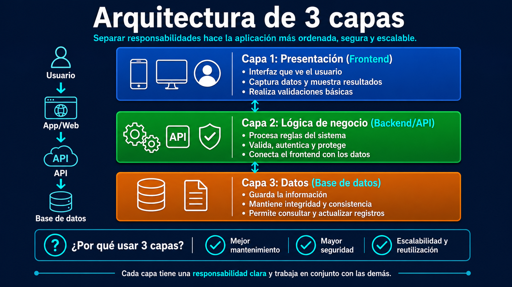

# Arquitectura de 3 Capas en el muno "móvil"

La arquitectura básica de software en **3 capas**, y aplicada a **aplicaciones móviles** significa separar claramente lo que ve el usuario, lo que procesa el servidor y dónde se guardan los datos.




## 1. Usuario → App móvil


En una aplicación móvil, el **usuario** interactúa con pantallas, botones, formularios, menús, notificaciones y flujos de navegación.

Ejemplo: una app de pedidos de comida.

El usuario puede:

* iniciar sesión;
* ver restaurantes;
* agregar productos al carrito;
* pagar;
* consultar el estado del pedido.

Todo eso ocurre primero en la **interfaz móvil**, pero la app no debería hacer todo por sí sola.

---

# Capa 1: Frontend móvil

En el contexto móvil, el **frontend** es la aplicación instalada o ejecutada en el dispositivo.

Puede estar construida con tecnologías como:

* Android nativo: Kotlin o Java;
* iOS nativo: Swift;
* multiplataforma: Flutter, React Native, Ionic, .NET MAUI, Kotlin Multiplatform.

Esta capa se encarga de lo que el usuario ve y usa.

## Responsabilidades del frontend móvil

### Interfaz de usuario

Aquí viven las pantallas de la app:

* pantalla de login;
* pantalla de registro;
* pantalla de perfil;
* listado de productos;
* carrito;
* historial;
* configuración.

### Experiencia y validaciones básicas

La app puede validar cosas simples antes de enviar datos al servidor.

Ejemplo:

* que el correo tenga formato válido;
* que la contraseña no esté vacía;
* que el número telefónico tenga cierta longitud;
* que se hayan aceptado términos y condiciones;
* que un campo obligatorio esté completo.

Pero estas validaciones son **básicas**. No deben ser la única protección.

### Consume APIs

La app móvil normalmente se comunica con el backend usando APIs.

Ejemplo:

```text
App móvil → API → Base de datos
```

Cuando el usuario inicia sesión, la app no revisa directamente la base de datos. Envía una solicitud al backend:

```text
POST /login
```

Cuando quiere ver productos:

```text
GET /products
```

Cuando crea un pedido:

```text
POST /orders
```

La app móvil pide información, muestra resultados y envía acciones del usuario.

---

# Capa 2: Backend / API

El **backend** es el sistema del lado del servidor. Es el cerebro de la aplicación.

En una app móvil seria, el backend se encarga de aplicar la lógica importante, proteger los datos y coordinar operaciones.

Puede estar desarrollado con tecnologías como:

* Node.js;
* Java / Spring Boot;
* Python / Django / FastAPI;
* C# / .NET;
* PHP / Laravel;
* Go;
* Ruby on Rails.

## Responsabilidades del backend

### Lógica de negocio

La lógica de negocio son las reglas reales del sistema.

Ejemplo en una app bancaria:

* un usuario no puede transferir más dinero del que tiene;
* una transferencia debe generar un comprobante;
* ciertas operaciones requieren verificación adicional;
* los movimientos deben quedar registrados.

Ejemplo en una app de delivery:

* no se puede pedir a un restaurante cerrado;
* el costo de envío depende de la zona;
* el pedido cambia de estado: creado, pagado, en preparación, enviado, entregado;
* un cupón solo puede usarse una vez.

Estas reglas no deberían depender solo de la app móvil, porque una app puede ser manipulada, descompilada o modificada.

### Validaciones reales

El backend debe volver a validar todo.

Aunque la app móvil ya haya validado un formulario, el backend debe comprobarlo otra vez.

Ejemplo:

La app móvil puede impedir enviar una cantidad negativa, pero el backend también debe rechazarla.

```text
Cantidad: -100
```

No basta con confiar en el frontend.

### Seguridad y reglas del sistema

El backend maneja aspectos críticos como:

* autenticación;
* autorización;
* tokens;
* permisos;
* roles;
* cifrado;
* límites de uso;
* protección contra abuso;
* auditoría;
* reglas de acceso a datos.

Ejemplo:

Un usuario puede consultar **sus propios pedidos**, pero no los pedidos de otro usuario.

La app móvil podría intentar pedir:

```text
GET /orders/999
```

Pero el backend debe verificar:

```text
¿Este pedido pertenece al usuario autenticado?
```

---

# Capa 3: Persistencia de datos

La capa de **persistencia** es donde se guardan los datos de forma permanente.

Puede incluir:

* bases de datos SQL: PostgreSQL, MySQL, SQL Server;
* bases NoSQL: MongoDB, Firebase Firestore, DynamoDB;
* almacenamiento de archivos: S3, Cloud Storage;
* caché: Redis;
* motores de búsqueda: Elasticsearch, OpenSearch.

## Responsabilidades de esta capa

### Bases de datos

Aquí se guardan datos como:

* usuarios;
* sesiones;
* productos;
* pedidos;
* pagos;
* mensajes;
* configuraciones;
* historial;
* archivos;
* notificaciones.

### Modelos y repositorios

Los **modelos** representan entidades del sistema.

Ejemplo:

```text
Usuario
Producto
Pedido
Pago
Dirección
Notificación
```

Los **repositorios** son componentes del backend que se encargan de consultar o guardar datos.

Ejemplo:

```text
UserRepository
OrderRepository
ProductRepository
```

Su función es evitar que el resto del backend tenga consultas de base de datos mezcladas por todas partes.

### Integridad y consistencia

Esta capa ayuda a mantener los datos correctos.

Ejemplo:

* no duplicar usuarios con el mismo correo;
* no crear un pedido sin usuario;
* no registrar un pago sin pedido;
* no permitir estados inválidos;
* mantener relaciones correctas entre tablas o colecciones.

---

# Flujo completo en una app móvil

Imagina una app móvil de reservas de citas médicas.

## Caso: el usuario agenda una cita

### 1. El usuario toca un botón

En la app móvil:

```text
Reservar cita
```

### 2. El frontend valida datos básicos

La app revisa:

* que se haya elegido médico;
* que exista fecha;
* que exista hora;
* que el usuario esté conectado a internet.

### 3. La app llama al backend

La app envía una solicitud:

```text
POST /appointments
```

Con datos como:

```json
{
  "doctorId": 15,
  "date": "2026-05-10",
  "time": "09:00"
}
```

### 4. El backend aplica reglas reales

El backend verifica:

* si el usuario está autenticado;
* si el médico existe;
* si el horario está disponible;
* si el paciente puede reservar;
* si no hay choque de horarios;
* si la clínica está abierta.

### 5. El backend usa el repositorio

El servicio del backend llama a algo como:

```text
AppointmentRepository
```

para consultar y guardar en la base de datos.

### 6. La base de datos guarda la cita

Se registra la cita en la tabla o colección correspondiente.

### 7. El backend responde a la app

La API responde:

```json
{
  "status": "success",
  "message": "Cita reservada correctamente"
}
```

### 8. La app muestra el resultado

El frontend móvil muestra:

```text
Tu cita fue reservada correctamente.
```

---

# Separación interna del backend

La imagen también muestra una separación importante dentro del backend:

```text
Controller → Service → Repository
```

Esto es muy útil en aplicaciones móviles porque la app consume APIs, pero la API debe estar bien organizada internamente.

## Controller

El **controller** recibe las solicitudes desde la app móvil.

Ejemplo:

```text
POST /login
GET /products
POST /orders
PUT /profile
```

Su trabajo principal es recibir la petición, leer datos básicos y devolver una respuesta.

No debería contener toda la lógica del sistema.

## Service

El **service** contiene la lógica de negocio.

Ejemplo:

```text
OrderService
PaymentService
UserService
NotificationService
```

Aquí se decide qué debe pasar.

Ejemplo:

```text
Si el usuario tiene saldo suficiente,
crear pedido,
descontar saldo,
generar comprobante,
enviar notificación.
```

## Repository

El **repository** accede a los datos.

Ejemplo:

```text
UserRepository.findByEmail()
OrderRepository.save()
ProductRepository.findAvailable()
```

Sirve para separar la lógica de negocio de las consultas a la base de datos.

---

# Ejemplo aplicado: login en una app móvil

## Mala práctica

La app móvil se conecta directo a la base de datos:

```text
App móvil → Base de datos
```

Esto es peligroso porque:

* expone credenciales;
* dificulta controlar permisos;
* permite ataques más directos;
* rompe la lógica del sistema;
* no escala bien.

## Buena práctica

La app móvil se conecta al backend:

```text
App móvil → API → Backend → Base de datos
```

Flujo correcto:

```text
LoginScreen
   ↓
POST /auth/login
   ↓
AuthController
   ↓
AuthService
   ↓
UserRepository
   ↓
Base de datos
```

El backend valida usuario, contraseña, estado de la cuenta, permisos y genera un token seguro.

---

# Por qué esta arquitectura funciona en apps móviles

## 1. Cada capa tiene una responsabilidad clara

La app móvil se enfoca en la experiencia del usuario.

El backend se enfoca en reglas, seguridad y procesamiento.

La base de datos se enfoca en guardar información correctamente.

Esto evita mezclar todo.

---

## 2. Facilita pruebas y mantenimiento

Puedes probar cada parte por separado.

Ejemplo:

* probar pantallas móviles;
* probar endpoints de la API;
* probar servicios del backend;
* probar consultas a base de datos.

Si hay un error en pagos, no tienes que revisar toda la app. Puedes ir al módulo de pagos del backend.

---

## 3. Permite escalar sin romper todo

Puedes mejorar una capa sin rehacer las demás.

Ejemplo:

* cambiar la app móvil de React Native a Flutter;
* cambiar la base de datos de MySQL a PostgreSQL;
* dividir el backend en microservicios;
* agregar caché con Redis;
* añadir notificaciones push;
* crear una versión web usando la misma API.

La app móvil puede evolucionar sin destruir todo el sistema.

---

# Errores comunes al empezar

## Error 1: poner toda la lógica en el controller

Mala práctica:

```text
Controller con 500 líneas de código
```

El controller recibe la petición, valida, calcula, consulta la base de datos, envía correos y responde.

Eso se vuelve difícil de mantener.

Mejor:

```text
Controller → Service → Repository
```

---

## Error 2: conectar el frontend directo a la base de datos

En apps móviles esto es especialmente peligroso.

Una app instalada en un dispositivo puede ser analizada, interceptada o modificada. Si contiene credenciales o acceso directo a la base de datos, el sistema queda expuesto.

La app debe hablar con una API, no directamente con la base de datos.

---

## Error 3: no separar responsabilidades

Cuando todo está mezclado:

* las pantallas hacen consultas;
* los controllers tienen lógica compleja;
* los services acceden directamente a detalles técnicos;
* las reglas están duplicadas;
* cambiar algo rompe otras partes.

Separar responsabilidades hace que el proyecto sea más ordenado, seguro y escalable.

---

# Arquitectura recomendada para una app móvil

Una arquitectura básica y saludable podría verse así:

```text
App móvil
│
├── Pantallas / UI
├── Estado local
├── Validaciones básicas
├── Cliente HTTP
└── Manejo de sesión/token
        │
        ▼
API / Backend
│
├── Controllers
├── Services
├── Repositories
├── Seguridad
├── Reglas de negocio
└── Integraciones externas
        │
        ▼
Base de datos
│
├── Usuarios
├── Productos
├── Pedidos
├── Pagos
└── Notificaciones
```

---

# Ejemplo con módulos reales

Para una app móvil de comercio electrónico:

## Frontend móvil

* LoginScreen
* ProductListScreen
* ProductDetailScreen
* CartScreen
* CheckoutScreen
* ProfileScreen

## Backend/API

* AuthController
* ProductController
* CartController
* OrderController
* PaymentController

## Services

* AuthService
* ProductService
* CartService
* OrderService
* PaymentService
* NotificationService

## Repositories

* UserRepository
* ProductRepository
* CartRepository
* OrderRepository
* PaymentRepository

## Base de datos

* users
* products
* carts
* orders
* payments
* notifications

---

# Idea clave

En aplicaciones móviles, esta arquitectura evita que la app sea un “todo en uno”. La app móvil debe ser principalmente la **cara visible** del sistema, mientras que el backend debe ser el **centro de control**, y la base de datos debe ser la **fuente confiable de información**.

La frase final de la imagen lo resume muy bien:

**“La arquitectura no es para hoy, es para el futuro del proyecto.”**

Porque al principio una app pequeña puede funcionar con código mezclado, pero cuando crece, aparecen usuarios reales, pagos, seguridad, notificaciones, errores y mantenimiento. Una buena arquitectura permite que el proyecto crezca sin volverse inmanejable.
