# RULETA_JAIDER_FIREBASE  
Guía paso a paso para publicar una aplicación web (ej. Ruleta o similar) en **Firebase Hosting** con **Cloud Firestore**

Este documento muestra el proceso completo de configuración de Firebase para una aplicación web que usa base de datos.

## Paso 1: Seleccionar o crear cuenta en Firebase

Inicia sesión en la consola de Firebase con tu cuenta de Google.


## Paso 2: Crear un nuevo proyecto

Ve a la consola → **Crear proyecto** → ponle nombre (ej. `ruleta-jaider-2026`)

(Imagen de la pantalla de creación de proyecto)

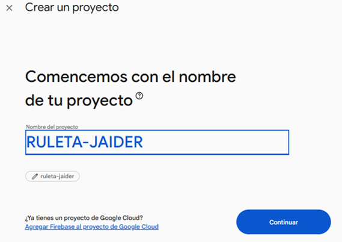

Agregar si se desea google analytcs.

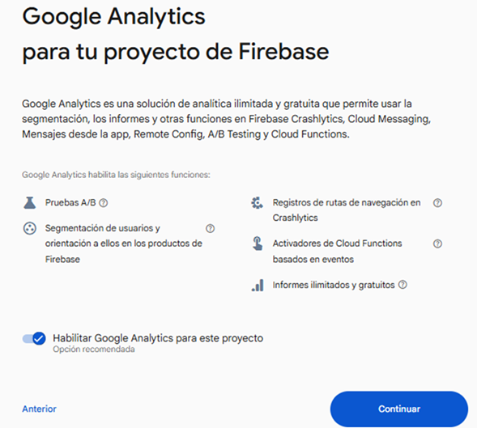

**Seleccionar una cuenta:**

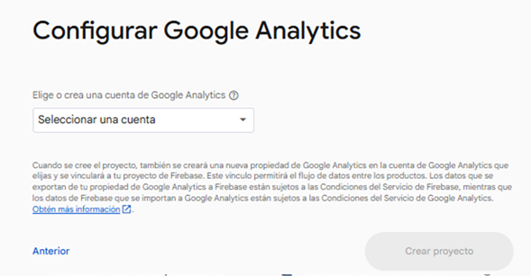

**Configurar google analiytics**

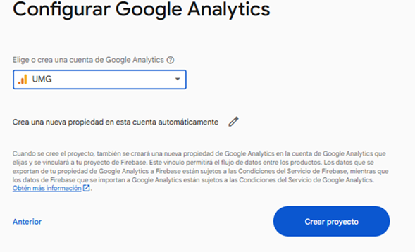.


Esto procede a crear el proyecto tra unos segundos como se observa en la imagén.


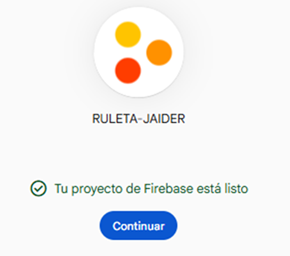.


## Paso 3: Habilitar Firestore y crear la base de datos

1. En el menú lateral → **Firestore Database**  
2. Haz clic en **Crear base de datos**  
3. Elige **Modo de prueba** (para desarrollo)  
4. Selecciona ubicación cercana (ej. nam5 – us-central)  
5. Confirma

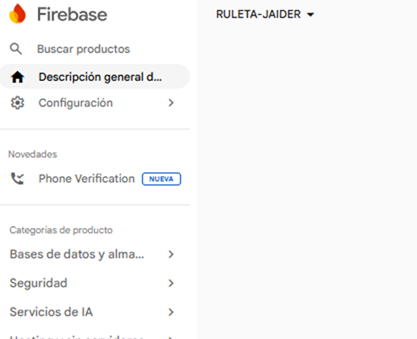

Selecionar en base de datos el simbolo de NoSQL "firestore"

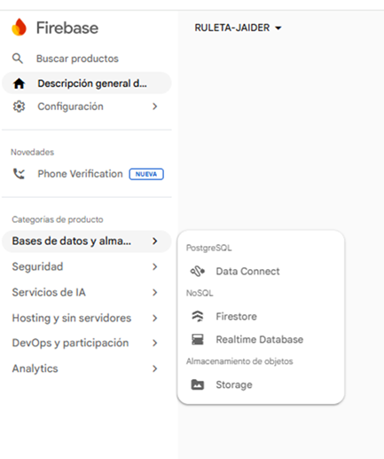

Acto seguido "Crear base de datos"

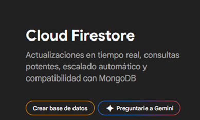

Seleccionar la opción "Standard"

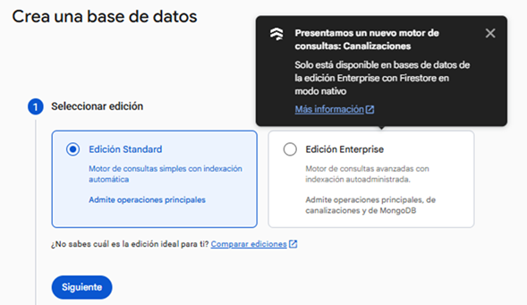

Seleccionar Ubicación.

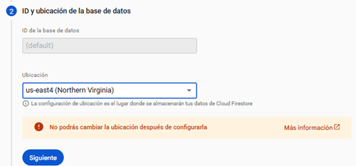

Agregar reglas de acceso.

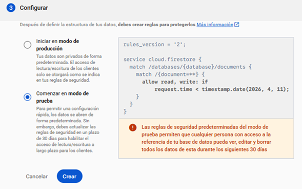

## Paso 4: Mensaje de base de datos lista

Una vez creada, verás este mensaje:

> La base de datos está lista. Solo tienes que agregar datos.


## Paso 5: Consola de Firestore vacía (sin datos aún)

Vista inicial de la colección vacía.

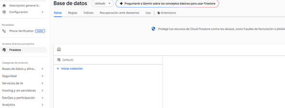

## Paso 6: Reglas de seguridad por defecto (modo test)

Reglas iniciales en modo prueba (válidas 30 días):

```rules
rules_version = '2';
service cloud.firestore {
  match /databases/{database}/documents {
    match /{document=**} {
      allow read, write: if true;
    }
  }
}
```

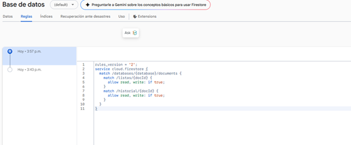

## Paso 7: Inicializar Firebase CLI en tu proyecto local

En la terminal, dentro de la carpeta de tu app web:

```bash
firebase init hosting
```

Selecciona **Hosting** y **Firestore**.

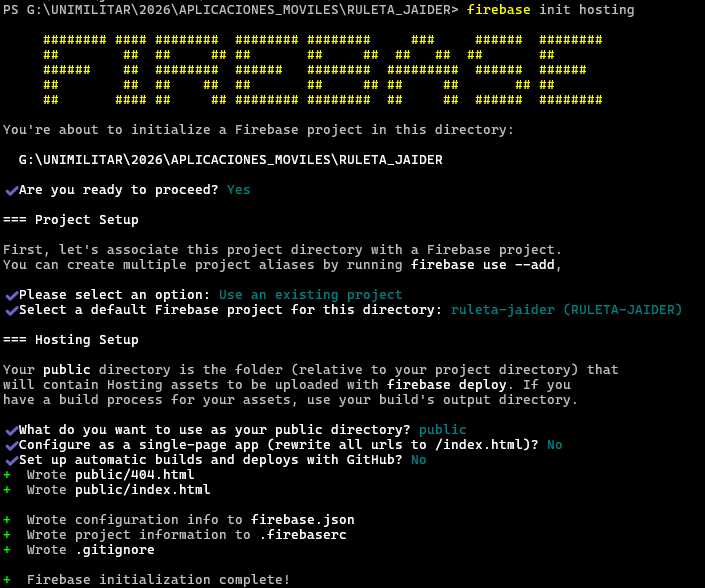

## Paso 8: Opciones seleccionadas en firebase init

Marca Hosting y Firestore (usa espacio para seleccionar).


## Paso 9: Archivo firebase.json generado

Ejemplo típico después de la inicialización:

```json
{
  "hosting": {
    "public": "dist",
    "ignore": ["firebase.json", "**/.*", "**/node_modules/**"],
    "rewrites": [{ "source": "**", "destination": "/index.html" }]
  }
}
```


## Paso 10: Ejemplo de reglas Firestore más seguras

Edita `firestore.rules` antes de deploy (ejemplo básico autenticado):

```rules
rules_version = '2';
service cloud.firestore {
  match /databases/{database}/documents {
    match /ruleta/{document=**} {
      allow read: if true;
      allow write: if request.auth != null;
    }
  }
}
```


## Paso 11: Deploy exitoso

Ejecuta:

```bash
firebase deploy --only hosting
```

Verás algo similar:

> ✔  Deploy complete!  
> Hosting URL: https://ruleta-jaider-2026.web.app

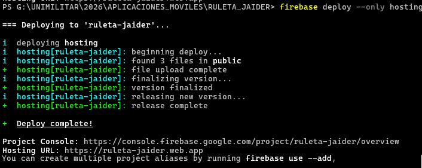

## Paso 12: URL de la aplicación publicada

Accede desde cualquiera de estas URLs:

- https://ruleta-jaider-2026.web.app  
- https://ruleta-jaider-2026.firebaseapp.com

## Paso 13: Vista final de la aplicación en vivo

(Agrega aquí la captura de tu ruleta o interfaz web ya funcionando)


---

¡Listo! Tu aplicación ya está publicada y conectada a Firestore.

### Notas finales

- Cambia las reglas de seguridad antes de producción  
- Usa autenticación si vas a permitir escritura  
- Para dominio personalizado: Hosting → Conectar dominio  
- Monitorea uso en la consola (gratis hasta ciertos límites)

