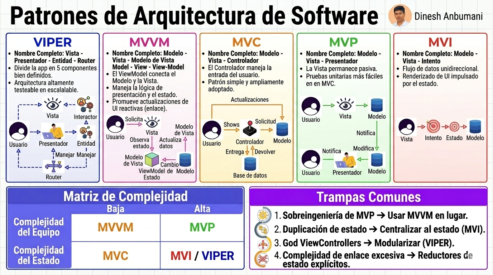

## Introducción a los Patrones Arquitecturales

   

### ¿Qué son los Patrones Arquitecturales?
En el desarrollo de software, un **patrón arquitectural** es una solución general y reutilizable a problemas que ocurren comúnmente dentro de un contexto determinado. No es un trozo de código que se pueda copiar y pegar, sino un **plano o esquema organizativo** que define la estructura de alto nivel de un sistema.

Si comparamos la programación con la construcción, los patrones arquitecturales no deciden el color de las paredes, sino dónde van las columnas de soporte, cómo se distribuyen las tuberías y cómo se conectan los diferentes pisos para que el edificio no se colapse.

### ¿Cuál es su utilidad?
Implementar estos patrones no es una cuestión de "preferencia estética", sino de necesidad técnica para garantizar la supervivencia de un proyecto a largo plazo. Su utilidad se resume en tres pilares:

1.  **Separación de Responsabilidades (SoC):** Permiten que cada parte del código tenga una función única. Por ejemplo, que el código que dibuja un botón no sea el mismo que calcula los impuestos en una base de datos. Esto facilita enormemente el mantenimiento.
2.  **Facilidad de Pruebas (Testability):** Al estar el código organizado en compartimentos lógicos, es mucho más sencillo realizar pruebas automáticas para asegurar que una actualización no rompa funciones existentes.
3.  **Escalabilidad y Trabajo en Equipo:** Cuando un equipo utiliza un patrón estándar (como MVVM o VIPER), cualquier desarrollador nuevo puede entender rápidamente dónde encontrar cada funcionalidad. Además, permite que el sistema crezca en funciones sin convertirse en un "código espagueti" inmanejable.

> **En resumen:** Los patrones arquitecturales transforman el desarrollo artesanal en **ingeniería de software**, permitiendo crear aplicaciones robustas, fáciles de entender y preparadas para el cambio.

---

# Patrones de Arquitectura de Software

Esta guía detalla los patrones de diseño para la capa de presentación y lógica de negocio, optimizando la separación de responsabilidades y la escalabilidad del código.

## 1. VIPER
**Nombre Completo:** Vista - Interactor - Presentador - Entidad - Router
Es el patrón más modular, utilizado frecuentemente en aplicaciones iOS de alta complejidad.

* **Vista:** Muestra lo que el Presentador le indica.
* **Interactor:** Contiene la lógica de negocio (casos de uso).
* **Presentador:** El "cerebro" que formatea datos para la vista y reacciona a eventos.
* **Entidad:** Objetos de datos simples (modelos).
* **Router:** Maneja la navegación entre pantallas.

> **Ejemplo:** En una app de banca, al pulsar "Ver Saldo", la **Vista** avisa al **Presentador**, el **Presentador** pide al **Interactor** el dato, este lo trae de la **Entidad** (Base de datos), el **Presentador** lo formatea como moneda y la **Vista** lo muestra.

---

## 2. MVVM
**Nombre Completo:** Modelo - Vista - Modelo de Vista (Model-View-ViewModel)
El estándar actual para desarrollo moderno (Android/Jetpack Compose, iOS/SwiftUI, React).

* **Modelo:** Los datos y la lógica de acceso a datos.
* **Vista:** La interfaz de usuario.
* **ViewModel:** Expone el estado de la aplicación a la Vista mediante *Data Binding* (enlace de datos).

> **Ejemplo:** Un formulario de registro donde, a medida que el usuario escribe (Vista), el **ViewModel** valida en tiempo real si el correo es válido y actualiza un color de borde sin que la Vista tenga que pedirlo manualmente (reactividad).

---

## 3. MVC
**Nombre Completo:** Modelo - Vista - Controlador
El patrón clásico y más conocido, base de muchos frameworks web (como Django o Laravel).

* **Modelo:** Gestiona los datos y reglas de negocio.
* **Vista:** Representación visual de los datos (HTML/XML).
* **Controlador:** Recibe las entradas del usuario (clics, peticiones HTTP) y actualiza el Modelo o la Vista.

> **Ejemplo:** En un sitio web de noticias, haces clic en un enlace (**Controlador**), este pide el artículo al **Modelo** y luego le entrega esos datos a una plantilla (**Vista**) para que se renderice en tu navegador.

---

## 4. MVP
**Nombre Completo:** Modelo - Vista - Presentador
Una evolución del MVC donde el Presentador tiene el control total sobre la Vista.

* **Modelo:** Capa de datos.
* **Vista:** Interfaz pasiva que no conoce al Modelo.
* **Presentador:** Actúa como mediador. Lee del Modelo y le dice a la Vista exactamente qué mostrar a través de una interfaz.

> **Ejemplo:** Una aplicación de escritorio donde el **Presentador** recupera una lista de usuarios y ejecuta explícitamente `Vista.mostrarLista(usuarios)`. Es ideal para facilitar las pruebas unitarias.

---

## 5. MVI
**Nombre Completo:** Modelo - Vista - Intento (Model-View-Intent)
Basado en el flujo de datos unidireccional (similar a Redux en React).

* **Modelo:** Representa un "estado" inmutable de la pantalla en un momento dado.
* **Vista:** Renderiza el estado actual.
* **Intento (Intent):** La intención del usuario de realizar una acción (ej. "Click en refrescar").

> **Ejemplo:** Al pulsar "Cargar", se envía un **Intento**. El sistema genera un nuevo **Modelo** con el estado `cargando: true`. La **Vista** reacciona mostrando un spinner. Cuando los datos llegan, se genera otro **Modelo** con `cargando: false` y los datos, y la **Vista** se actualiza automáticamente.

---

## Comparativa de Selección

| Característica | MVC | MVP | MVVM | MVI / VIPER |
| :--- | :--- | :--- | :--- | :--- |
| **Complejidad** | Baja | Media | Media-Alta | Alta |
| **Testabilidad** | Difícil | Buena | Excelente | Excelente |
| **Acoplamiento** | Alto | Bajo | Muy Bajo | Desacoplado |
| **Uso Ideal** | Web simple | Apps pequeñas | Apps modernas | Apps Enterprise |

Elegir el patrón adecuado para el desarrollo móvil es crítico debido a las limitaciones de hardware (batería, memoria) y la naturaleza del ciclo de vida de las aplicaciones (interrupciones por llamadas, cambios de orientación, pérdida de conexión).

A continuación, presento los criterios de selección específicos para el ecosistema móvil:

---

## Criterios de Selección en Entornos Móviles

### 1. MVVM: El estándar de la industria
Hoy en día, es la opción por defecto tanto en **Android** (con Jetpack Compose y ViewModel) como en **iOS** (con SwiftUI y el protocolo ObservableObject).

* **Por qué elegirlo:** Permite que la interfaz de usuario sea una "función" del estado. Si los datos cambian en el ViewModel, la pantalla se actualiza sola.
* **Ideal para:** Aplicaciones con interfaces de usuario dinámicas y formularios complejos.
* **Ventaja móvil:** Maneja de forma excelente la persistencia de datos cuando giras el teléfono o cambias entre aplicaciones.

### 2. VIPER: Para equipos grandes y alta complejidad
Es muy común en aplicaciones bancarias o de e-commerce masivas, especialmente en el ecosistema iOS.

* **Por qué elegirlo:** Cuando tienes 10 o más desarrolladores trabajando en la misma app. Al dividir todo en 5 componentes, es casi imposible que dos programadores tengan conflictos al editar el mismo archivo.
* **Ideal para:** Apps con flujos de navegación muy complejos y donde la lógica de negocio debe estar totalmente aislada de la plataforma.
* **Ventaja móvil:** Facilita el "Unit Testing" al 100%, algo vital en apps críticas donde un error puede costar dinero al usuario.

### 3. MVI: Para aplicaciones altamente reactivas
Es el patrón más moderno, inspirado en el flujo unidireccional de la web (Redux).

* **Por qué elegirlo:** Elimina los errores de "estado inconsistente" (cuando la UI muestra algo que no coincide con los datos reales).
* **Ideal para:** Apps que reciben datos constantes en tiempo real (ej. trading, chats, redes sociales).
* **Ventaja móvil:** Ofrece una "única fuente de verdad", lo que facilita mucho la depuración (debugging) porque puedes rastrear exactamente qué acción causó qué cambio en la pantalla.

---

## Matriz de Decisión Rápida para Móvil

| Situación | Patrón Recomendado |
| :--- | :--- |
| **MVP (Producto Mínimo Viable) / Prototipo** | **MVC** o **MVVM** simple. |
| **Proyecto profesional estándar (Android/iOS)** | **MVVM**. |
| **App con lógica de negocio pesada y muchos módulos** | **VIPER**. |
| **App con flujos de datos complejos y tiempo real** | **MVI**. |

---
