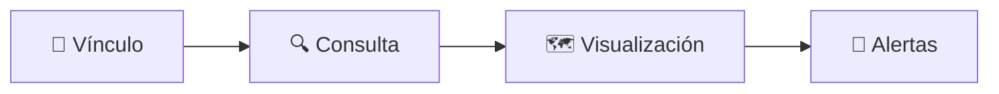

# PetTrack 🐾

Aplicación Android para rastreo de mascotas con chip GPS GF-07


---

## Características

- 📍 Rastreo GPS vía SMS con chip GF-07
- 🔔 Geocercas con alertas de alarma
- 👤 Múltiples perfiles locales 
- 🗺️ Historial de ubicaciones
- 🌍 Mapas OpenStreetMap 

## Requisitos

- Android 8.0+ (API 26)
- Chip GPS GF-07 con SIM activa
- Permisos: SMS, Ubicación, Notificaciones

---

## Screenshots

### Interfaz principal

Esta será la pantalla que verás al abrir la aplicación, donde podrás crear tu primer usuario. Solo hay que completar los campos: **Nombre visible**, **Usuario**, **Contraseña** y **Confirmar contraseña**. Cuando vuelvas a ingresar, puedes crear otro usuario o introducir tus datos para acceder a uno previamente creado.

<div align="center">
  
  &nbsp;&nbsp;
  
  <br/>
  <sub>Inicio de sesión &nbsp;&nbsp;&nbsp; Creación de cuenta</sub>
</div>

---

### Pantalla de inicio

Después de crear el usuario verás esta pantalla, donde se mostrará información sobre tus mascotas, geocercas, alertas y otros menús para seguir configurando el seguimiento de tu mascota.

<div align="center">
  
</div>

---

### Pantalla de mascotas

Aquí podrás agregar tus mascotas, cargar una foto, completar algunas características sobre ellas, vincular un chip y elegir si quieres que sean visibles para otros usuarios.

<div align="center">
  
  &nbsp;&nbsp;
  
  &nbsp;&nbsp;
  
  <br/>
  
  <br/>
  <sub>Agregar mascota &nbsp;&nbsp;&nbsp; Tipo de mascota &nbsp;&nbsp;&nbsp; Configuración de chip</sub>
</div>

---

### Inicio con mascota y edición

Así verás la pantalla de inicio una vez que hayas agregado una mascota. Al presionar sobre el nombre de tu mascota podrás ver sus características y editarlas, compartirla con otros usuarios (si hay 3 o más), consultar el historial de ubicaciones y crear una geocerca.

<div align="center">
  
  &nbsp;&nbsp;
  
  &nbsp;&nbsp;
  
  <br/>
  <sub>Inicio &nbsp;&nbsp;&nbsp; Detalle de mascota &nbsp;&nbsp;&nbsp; Opciones</sub>
</div>

---

### Historial, compartir mascota y geocercas

En el historial podrás ver las ubicaciones recientes de tu mascota. En compartir mascota puedes elegir qué usuarios podrán verla. En geocercas verás las que hayas configurado y podrás activarlas o desactivarlas.

<div align="center">
  
  &nbsp;&nbsp;
  
  &nbsp;&nbsp;
  
  <br/>
  <sub>Compartir mascota &nbsp;&nbsp;&nbsp; Historial &nbsp;&nbsp;&nbsp; Geocercas</sub>
</div>

---

### Crear una geocerca

Puedes crear una geocerca desde las opciones de tu mascota o desde el menú de geocercas. El proceso es el siguiente:

1. Selecciona la mascota a la que aplicará
2. Asigna un nombre a la geocerca
3. Elige la ubicación manualmente en el mapa, búscala por dirección o usa tu ubicación actual
4. Ajusta el radio según tu necesidad
5. Configura si recibirás alerta al entrar, al salir o en ambos casos
6. Actívala antes de guardar

Desde el menú de geocercas podrás ver las activas, editarlas o eliminarlas.

<div align="center">
  
  &nbsp;&nbsp;
  
  &nbsp;&nbsp;
  
  <br/>
  
  <br/>
  <sub>Crear geocerca &nbsp;&nbsp;&nbsp; Configurar radio &nbsp;&nbsp;&nbsp; Tipo de alerta &nbsp;&nbsp;&nbsp; Geocercas activas</sub>
</div>

---

### Alertas y geocercas activas

En el menú de alertas podrás ver las notificaciones generadas por tu mascota. En el menú de geocercas aparecerán todas las creadas por el usuario y a qué mascota pertenece cada una.

<div align="center">
  
  &nbsp;&nbsp;
  
  <br/>
  <sub>Alertas &nbsp;&nbsp;&nbsp; Geocercas activas</sub>
</div>

---

### Gestión de perfiles

En el menú de perfil podrás editar tu información, cambiar de perfil o controlar un chip.

<div align="center">
  
  &nbsp;&nbsp;
  
  &nbsp;&nbsp;
  
  <br/>
  <sub>Perfil &nbsp;&nbsp;&nbsp; Cambiar perfil &nbsp;&nbsp;&nbsp; Gestión de perfiles</sub>
</div>

---

### Control de chip

En el apartado de control de chip puedes configurar los parámetros del chip, asignarlo a una mascota y enviar comandos como: obtener ubicación, detener, reiniciar o enviar comandos manuales.

<div align="center">
  
  &nbsp;&nbsp;
  
  <br/>
  <sub>Control de chip GF-07</sub>
</div>


## 📋 Requerimientos del Sistema

### ⚙️ Funcionales (RF)

| ID | Descripción |
|----|-------------|
| **RF1** | Emparejamiento seguro del smartphone como "Número Maestro". |
| **RF2** | Rastreo bajo demanda con actualización en mapa de Google Maps. |
| **RF3** | Telemetría en tiempo real (Batería, Señal GSM). |
| **RF4** | Interceptación y parseo automático de SMS mediante Regex. |
| **RF5** | Historial de rutas almacenado localmente con Room Database. |

### 🔒 No Funcionales (RNF)

| ID | Descripción |
|----|-------------|
| **RNF1** | Abstracción total de la mensajería SMS para el usuario final. |
| **RNF2** | Gestión de reintentos y timeouts ante latencia de red 2G. |
| **RNF3** | Bajo consumo de recursos en segundo plano. |
| **RNF4** | Persistencia de servicios de escucha (BroadcastReceivers). |

---

# 📡 GPS Tracker GF-07 — Guía Completa de Comandos SMS

> Documentación técnica basada en pruebas reales del dispositivo GF-07 fabricado por **Shenzhen Qianxun Yunchuang Technology Co., Ltd.**

---

## 🔧 Especificaciones del Dispositivo

| Parámetro | Detalle |
|-----------|---------|
| **Modelo** | GF-07 |
| **Fabricante** | Shenzhen Qianxun Yunchuang Technology Co., Ltd. |
| **Dirección** | No. 228 Hakan North Road, Bantian, Wuhe Community, Longgang District, Shenzhen, China |
| **Número de serie (Batch)** | 20250523 |
| **Certificación** | CE |
| **Módulo GSM** | Integrado (visible en PCB — chip con QR y código IMEI) |
| **Batería** | Li-Po 3.7V / ~150mAh (0.555Wh) |
| **Conector de carga** | Micro USB |
| **Tecnología de localización** | GSM (Cell-ID) + GPS (opcional vía GPRS) |
| **Comunicación** | SMS bidireccional |
| **Redes soportadas** | 2G GSM / GPRS |
| **Tamaño** | Ultra compacto (formato llave / tarjeta) |
| **País de fabricación** | China |

---

## 📋 Tabla de Comandos SMS

Los comandos se envían por SMS al número de la SIM insertada en el dispositivo.  
El dispositivo responde automáticamente al número remitente con la información solicitada.

> ⚠️ **Nota:** Algunos comandos solo funcionan si son enviados desde un número registrado como SOS (número autorizado). De lo contrario, el dispositivo responde: `Error: Not authorized!`

---

### 🔐 Configuración Inicial y Administración

| Comando SMS | Descripción | Respuesta esperada |
|-------------|-------------|-------------------|
| `begin123456` | Inicializa/activa el dispositivo con la contraseña por defecto | Confirmación de inicio |
| `admin#NUMERO#` | Registra un número como administrador principal | Confirmación |
| `FACTORY#` | Restablece el dispositivo a valores de fábrica | `OK! The terminal will restart after 60s!` |

> 🔑 La contraseña por defecto del dispositivo suele ser `123456`.

---

### 📞 Números SOS (Números de Emergencia Autorizados)

| Comando SMS | Descripción | Respuesta esperada |
|-------------|-------------|-------------------|
| `SOS#NUMERO#` | Registra un número en la posición SOS1 | `OK! SOS1:NUMERO SOS2: SOS3:` |
| `SOS,A,NUMERO#` | Registra un número en la primera ranura SOS disponible | `OK! SOS1:NUMERO SOS2: SOS3:` |
| `SOS#` | Consulta los números SOS registrados | Lista de SOS1, SOS2, SOS3 |

> ⚠️ Solo los números registrados como SOS pueden enviar comandos de desarmado. Intentar desde otro número retorna: `Error! Only SOS phone numbers are allowed to disarm.`

---

### 📍 Localización GPS / GPRS

| Comando SMS | Descripción | Respuesta esperada |
|-------------|-------------|-------------------|
| `URL#` | Solicita enlace con ubicación actual | URL de Google Maps (si GPS activo) |
| `777` | Solicita ubicación vía coordenadas | Coordenadas GPS |
| `gps#on#` | Activa el módulo GPS | Confirmación |
| `GPS#1#` | Activa GPS (variante alternativa) | Confirmación |
| `gprs#on#` | Activa la transmisión de datos GPRS | Confirmación |
| `gprs#1#` | Activa GPRS (variante alternativa) | Confirmación |
| `GPS,ON` | Activa GPS (formato alternativo con coma) | Confirmación |

---

### 🌐 Configuración APN (GPRS / Internet)

| Comando SMS | Descripción | Ejemplo |
|-------------|-------------|---------|
| `APN#nombre_apn#` | Configura el APN del operador | `APN#internet.comcel.com.co#` |
| `APN,nombre_apn` | Configura APN (formato con coma) | `APN,internet.comcel.com.co` |
| `APNAUTO#ON#` | Activa la detección automática de APN | `APNAUTO#ON#` |

**Respuesta de consulta APN:**
```
Currently use APN:,[nombre]
APN Auto Set:OFF/ON
```

> 📌 Para Colombia con Claro/Comcel usar: `APN#internet.comcel.com.co#`

---

### 🔔 Sistema de Defensa / Alarma por Vibración

| Comando SMS | Descripción | Respuesta esperada |
|-------------|-------------|-------------------|
| `DEFENSE#OFF#` | Desactiva el modo defensa (alarma) | `DEFENSE:1min` (tarda 1 min en desactivarse) |
| `defense#off#` | Igual al anterior (acepta minúsculas) | `DEFENSE:1min` |
| `DEFENSE,OFF` | Variante con coma | `DEFENSE:1min` |
| `defense#0#` | Desactiva defensa (variante numérica) | `DEFENSE:1min` |
| `SENSOR#ON#` | Activa el sensor de vibración | `SENSOR:10,30,1` |

> ⚠️ El comando `000` (desarmado de vibración) requiere que el número remitente esté registrado como SOS, de lo contrario: `Error! Please first enable vibration alarm function, and then perform the operation.`

---

### 🔇 Desarmado del Sistema

| Comando SMS | Descripción | Respuesta esperada |
|-------------|-------------|-------------------|
| `DISARM#123456#` | Desarma el sistema con contraseña | Confirmación |
| `disarm#123456#` | Igual (minúsculas válidas) | Confirmación |
| `DISARM,000000#` | Intento de desarmado con código alternativo | Según configuración |
| `000` | Desarmado rápido (solo desde número SOS) | Confirmación o error de autorización |
| `666` | Comando de modo/estado alternativo | Variable |

---

### 📊 Estado del Dispositivo

| Comando SMS | Descripción | Respuesta esperada |
|-------------|-------------|-------------------|
| `STATUS#` | Consulta el estado general del dispositivo | Ver ejemplo abajo |
| `777` | Consulta estado / posición alternativa | Coordenadas o info de estado |

**Ejemplo de respuesta a `STATUS#`:**
```
Battery:3.85V,NORMAL; GPRS:Link Down; GSM Signal Level:Low; GPS:OFF; ; Defense:ON;
```

---

### 📡 Centro de Monitoreo

| Comando SMS | Descripción | Ejemplo |
|-------------|-------------|---------|
| `CENTER#NUMERO#` | Registra un número de centro de monitoreo | `CENTER#3214605726#` |

**Respuesta:**
```
CENTER: [número registrado o vacío]
```

---

## 🔢 Códigos de Respuesta Numéricos

| Código | Significado |
|--------|-------------|
| `OK!` | Comando ejecutado correctamente |
| `Error: Not authorized!` | El número remitente no está autorizado |
| `Error! Only SOS phone numbers are allowed to disarm.` | Solo números SOS pueden desarmar |
| `Error! Please first enable vibration alarm function, and then perform the operation.` | Función de vibración no activada previamente |
| `The terminal will restart after 60s!` | Reinicio del dispositivo en progreso |

---

## 📱 Cómo Usar el Dispositivo

1. **Insertar SIM 2G** (nano SIM o micro SIM según modelo) con datos y llamadas activos.
2. **Cargar la batería** vía Micro USB hasta que el LED indique carga completa.
3. **Encender el dispositivo** — esperar que el módulo GSM se registre en la red (30-60 seg).
4. **Enviar `begin123456`** desde tu celular al número de la SIM del tracker para inicializarlo.
5. **Registrar tu número como SOS:** `SOS#TU_NUMERO#`
6. **Configurar APN** según tu operador: `APN#tu.apn.operador#`
7. **Solicitar ubicación:** envía `URL#` y recibirás un enlace a Google Maps.

---

## 🇨🇴 Configuración para Colombia

| Operador | APN |
|----------|-----|
| Claro / Comcel | `internet.comcel.com.co` |
| Movistar | `internet.movistar.com.co` |
| Tigo | `web.colombiamovil.com.co` |
| WOM | `wom.co` |

**Ejemplo comando:** `APN#internet.comcel.com.co#`

---

## ⚡ Notas Técnicas Importantes

- El módulo de comunicación es **2G GSM únicamente** — no funciona en redes 4G/5G puras. Verifica que tu operador tenga cobertura 2G activa.
- La localización por **Cell-ID (GSM)** es imprecisa (100m–2km); para mayor precisión se requiere activar GPRS y GPS.
- La batería de **~150mAh** tiene autonomía limitada. En modo defensa activa con GPS puede durar entre 6–24 horas.
- Los comandos son **case-insensitive** en su mayoría (acepta mayúsculas y minúsculas).
- El separador puede ser `#` o `,` según el comando — ver tabla.

---

## 🛠️ Troubleshooting

| Problema | Posible causa | Solución |
|----------|--------------|----------|
| `Error: Not authorized!` | Número no registrado como SOS | Enviar `SOS#TU_NUMERO#` primero |
| No responde a ningún comando | SIM sin saldo / sin red 2G | Verificar SIM y cobertura |
| `GPRS:Link Down` en STATUS | APN incorrecto o GPRS desactivado | Configurar APN y enviar `gprs#on#` |
| `GPS:OFF` en STATUS | GPS no activado | Enviar `gps#on#` |
| Ubicación muy imprecisa | Solo usando Cell-ID | Activar GPS+GPRS para mayor precisión |
| `The terminal will restart after 60s!` | Comando `FACTORY#` ejecutado | Esperar 60s y reconfigurar |

---

## 📸 Hardware

El dispositivo contiene:
- **PCB principal** con módulo GSM integrado (con IMEI grabado en QR visible en la placa)
- **Conector Micro USB** para carga
- **Batería Li-Po 3.7V** desmontable con conector JST
- **Carcasa plástica negra** compacta con etiqueta de certificación CE en la tapa trasera

---

## 🚨 Falla Documentada — Bloqueo por Exceso de Comandos

> ❌ **El dispositivo GF-07 de esta documentación quedó inutilizable** tras las pruebas realizadas. A continuación se describe el comportamiento observado para que otros usuarios lo tengan en cuenta.

### Síntomas del bloqueo

Durante las pruebas se enviaron múltiples comandos en secuencia (incluyendo variantes en mayúsculas, minúsculas, con `#` y con `,`) intentando configurar el dispositivo. Tras una cantidad elevada de SMS enviados en poco tiempo, el dispositivo presentó los siguientes síntomas:

- 🔴 **La luz LED permanece encendida de forma continua** cuando la SIM está insertada — no parpadea ni se apaga, lo cual es señal de que el firmware quedó en un estado anómalo.
- 📵 **No recibe llamadas** — el número de la SIM no contesta ni redirige al buzón de voz.
- 📨 **No responde a ningún comando SMS** — ni siquiera a `FACTORY#`, `begin123456` o `STATUS#`.
- 🔇 **No genera ninguna respuesta**, el dispositivo simplemente ignora toda comunicación entrante.

### Causa probable

El firmware del GF-07 parece tener un **mecanismo de protección ante spam de comandos** que, al recibir demasiados SMS en un período corto, bloquea la interfaz de comandos de forma permanente (o hasta un hard reset físico que no está documentado por el fabricante).

También es posible que la combinación de comandos inválidos o no autorizados repetidos haya corrompido el estado interno del firmware.

### Lo que NO funcionó para recuperarlo

- Enviar `FACTORY#` — sin respuesta
- Quitar y reinsertar la SIM — mismos síntomas
- Apagar y encender el dispositivo — la luz sigue encendida fija al insertar la SIM
- Esperar varias horas sin SIM y volver a insertarla — sin cambios

### Recomendaciones para evitar este problema

> ⚠️ **Si vas a probar comandos en el GF-07, hazlo con calma y de uno en uno.**

1. **Espera la respuesta del dispositivo** antes de enviar el siguiente comando (mínimo 30 segundos entre comandos).
2. **No envíes el mismo comando en variantes múltiples seguidas** — el dispositivo puede interpretarlo como ataque.
3. **Comienza siempre con `begin123456`** y verifica que responda antes de continuar.
4. **Registra tu número como SOS primero** (`SOS#TU_NUMERO#`) antes de enviar cualquier otro comando.
5. **Evita enviar más de 5–6 comandos consecutivos** sin obtener respuestas de confirmación.

### Estado final del dispositivo

| Indicador | Estado |
|-----------|--------|
| LED con SIM insertada | 🔴 Encendido fijo (no parpadea) |
| Respuesta a SMS | ❌ No responde |
| Recepción de llamadas | ❌ No contesta |
| Recuperación lograda | ❌ No fue posible |
| Estado general | **🔒 Bloqueado / Inutilizable** |

## 📱 Experiencia de Usuario (UX)

La aplicación oculta la complejidad del hardware mediante un flujo transparente:



1. **🔗 Vínculo** — El usuario registra el número del rastreador.
2. **🔍 Consulta** — Al pulsar "Rastrear", la app gestiona el SMS silencioso.
3. **🗺️ Visualización** — El enlace LBS recibido se traduce automáticamente a coordenadas en el mapa integrado.
4. **🔔 Alertas** — Notificaciones push inmediatas ante eventos de sonido o batería baja.
